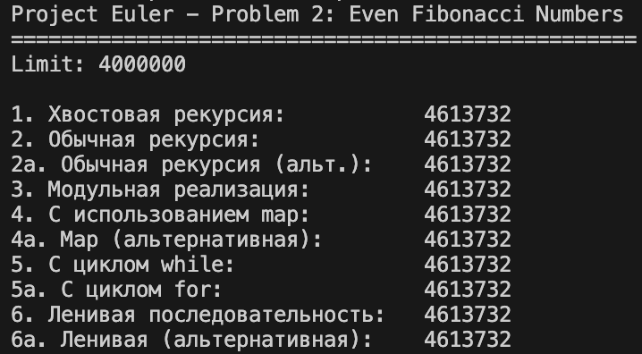
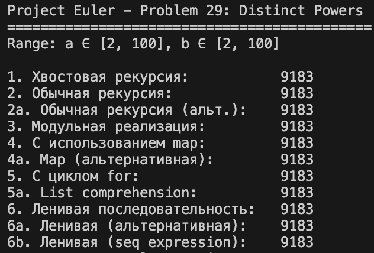
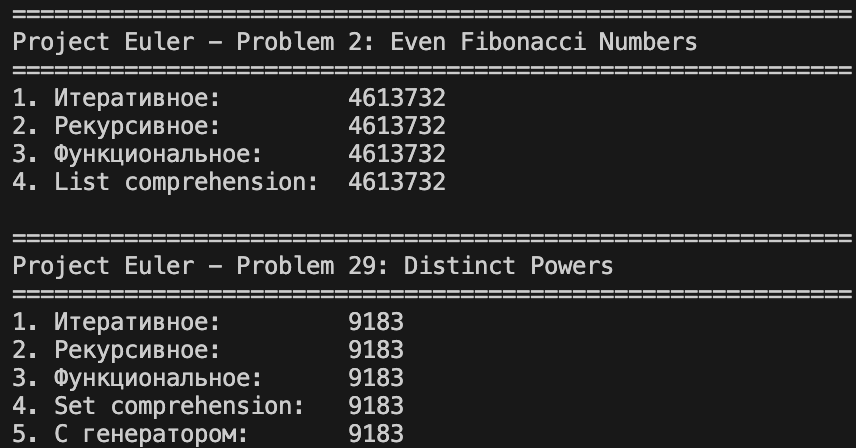

# Отчёт по лабораторной работе по функциональному программированию

## Титульный лист
Студент: Сабиров Амир  
Работа: Лабораторная №1  
Вариант: 2, 29  
Язык: F#  

---

## Цель работы
Освоить базовые приёмы функционального программирования:
функции, поток управления и поток данных, сопоставление с образцом,
рекурсию и хвостовую рекурсию, свёртку (fold/reduce), отображение (map),
работу с ленивыми последовательностями, функции как данные, списки.

---

## Описание задач

### Задача 2 (Project Euler) — Even Fibonacci Numbers
Дана последовательность Фибоначчи, начинающаяся с 1 и 2. Требуется найти сумму
чётных членов последовательности, значения которых не превышают 4 000 000.

#### Проверка задачи 2 (F#)

---

### Задача 29 (Project Euler) — Distinct Powers
Требуется определить количество различных значений $a^b$ для диапазонов
$2 \le a \le 100$ и $2 \le b \le 100$.

#### Проверка задачи 29 (F#)

---

## Реализация
Для каждой задачи реализованы разные стили функционального программирования:
- хвостовая рекурсия;
- обычная рекурсия;
- модульная реализация с явным разделением этапов: генерация → фильтрация → свёртка (fold);
- генерация последовательности при помощи отображения (map);
- использование специального синтаксиса циклов (for/while), где применимо;
- работа с ленивыми последовательностями (Seq).

### Файлы с реализацией
- `problem2.fsx` — решения для задачи 2;
- `problem29.fsx` — решения для задачи 29;
- `problems_python.py` — императивные версии на Python для сравнения.

---

## Сравнение с императивной реализацией (Python)

